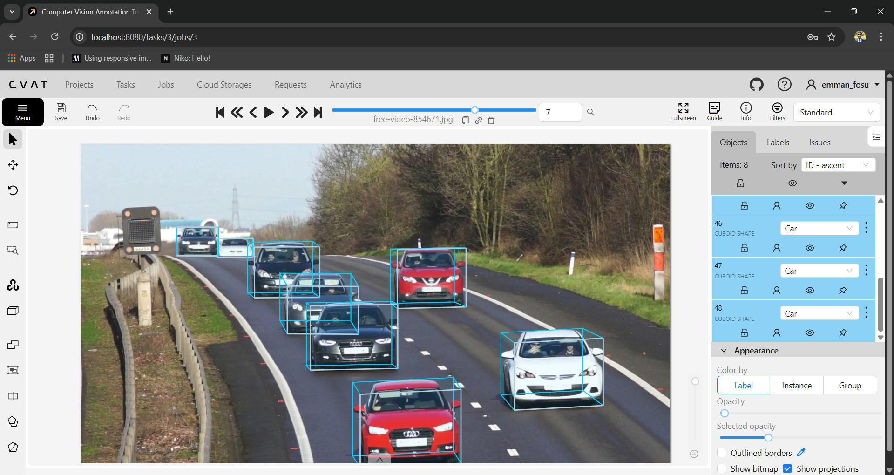
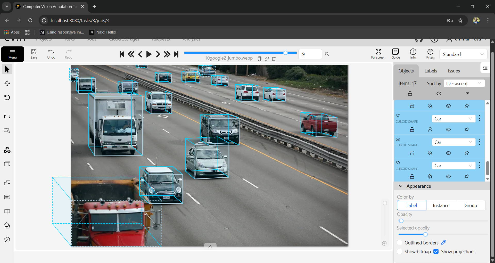

# 3D Cuboid Annotation of Cars
**3D Cuboid Annotation Pipeline for Vehicle Detection and Autonomous Driving Applications**
<video src="./assets/vid-1.mp4" width="100%" loop autoplay></video>

<video src="./assets/vid-2.mp4" width="100%" loop autoplay></video>

## Overview
This project demonstrates my ability to design and execute a complete **3D cuboid annotation workflow** for cars in street-view imagery.

## Project Gallery

The annotation task involves drawing **3D bounding cuboids** around vehicles to capture:
- object location
- vehicle size and geometry
- heading direction
- occlusion and truncation information

The output labels are intended for machine learning systems such as:
- 3D object detection models
- autonomous navigation models
- multi-object tracking models
- traffic flow analysis systems

This project showcases my expertise in:
- annotation guideline design
- dataset quality assurance
- labeling consistency enforcement
- data readiness for ML model training

---

## Problem Statement
Most computer vision datasets rely on 2D bounding boxes, but 2D boxes are limited because they do not capture:

- vehicle orientation
- depth perception
- true geometric boundaries
- occlusion reasoning

For tasks like autonomous driving, robots, and intelligent transportation systems, models require more precise spatial labels.

This project addresses that challenge by building a structured annotation system for **3D cuboid vehicle labeling**.

---

## Dataset Scope
### Objects Annotated
- Passenger cars (sedans, SUVs, hatchbacks, vans, pickups)

### Scene Types Covered
- urban roads
- highways
- parking lots
- intersections
- traffic congestion scenes

### Difficult Conditions Covered
- occlusion by other vehicles
- partial truncation at image edges
- motion blur
- low-light/night scenes
- perspective distortion from camera angle

---

## Annotation Format
Each vehicle instance is represented as a **3D cuboid** defined by:
- 8 corner points (3D projected in 2D image space)
- orientation/heading direction
- metadata attributes (occlusion, truncation)
