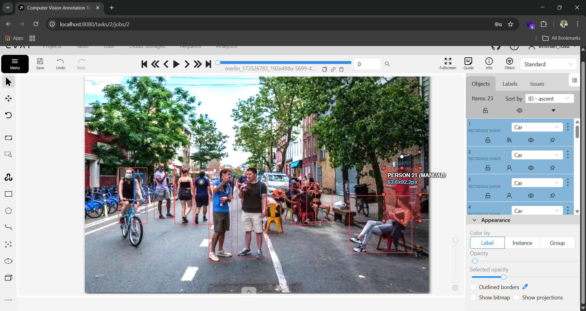
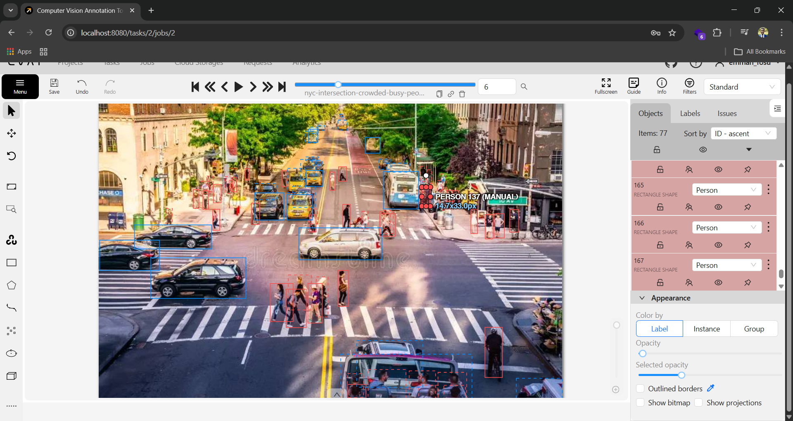
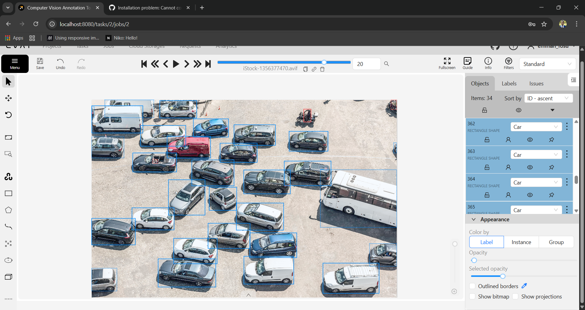

# Computer Vision Annotation Portfolio Project  
## Bounding Box Annotation of Cars and People Using CVAT

---

## 1. Project Summary

This portfolio project demonstrates my ability to **design, execute, and document a complete computer vision annotation workflow** using industry-standard tools and best practices.

The project focuses on creating a **high-quality object detection dataset** by annotating images with **bounding boxes** for **cars** and **people** using **CVAT (Computer Vision Annotation Tool)**.  

The resulting dataset is suitable for training and evaluating modern object detection models such as **YOLO, Faster R-CNN, and SSD**.

---

## 2. Objectives

The key objectives of this project are to:

- Demonstrate practical experience with CVAT
- Apply rigorous annotation guidelines for object detection
- Produce a clean, consistent, and ML-ready dataset
- Showcase understanding of dataset quality control and validation
- Present professional documentation suitable for real-world ML workflows

### Project Gallery

---

## 3. Dataset Overview

### 3.1 Data Type
- Static RGB images
- Diverse environments and viewpoints
- Varying lighting and occlusion conditions

### 3.2 Annotation Type
- 2D Bounding Boxes
- Single-label classification per object

### 3.3 Target Classes

| Class Name | Description |
|----------|-------------|
| Person | Any visible human in the scene |
| Car | Passenger motor vehicles (sedans, SUVs, hatchbacks) |

---

## 4. Annotation Tooling and Setup

### 4.1 Tool Used
- **CVAT (Computer Vision Annotation Tool)**

### 4.2 Task Configuration
- Annotation type: Image annotation
- Shape: Rectangle
- Labels: `person`, `car`

### 4.3 Annotation Standards
All annotations strictly follow the rules defined in:

- `annotation-guidelines.md`

This ensures consistency, reproducibility, and dataset reliability.

---

## 5. Annotation Workflow

### 5.1 Task Preparation
1. Image data uploaded to CVAT
2. Labels defined and validated
3. Tasks created and organized by image batches

---

### 5.2 Annotation Phase
- Each image is carefully reviewed
- All visible cars and people are annotated
- Bounding boxes are tightly fitted to object boundaries
- Ambiguous cases are flagged using CVAT comments

---

### 5.3 Quality Control and Review

To ensure professional-grade output, a structured review process was applied:

- Visual inspection of bounding box accuracy
- Verification of correct class assignment
- Consistency checks across similar scenes
- Correction of missed or duplicate annotations

---

## 6. Quality Assurance Criteria

Annotations are evaluated against the following criteria:

- **Completeness:** All target objects are labeled
- **Accuracy:** Correct class assignment
- **Precision:** Tight and consistent bounding boxes
- **Consistency:** Uniform labeling across the dataset

This process mirrors quality assurance practices used in production ML pipelines.

---

## 7. Export Formats and ML Readiness

The dataset can be exported from CVAT in the following formats:

- COCO
- Pascal VOC
- YOLO
- CVAT XML

This ensures immediate compatibility with common deep learning frameworks such as **PyTorch** and **TensorFlow**.

---

## 8. Skills Demonstrated

This project demonstrates proficiency in:

- Computer vision dataset creation
- Bounding box annotation for object detection
- CVAT task configuration and management
- Annotation quality control and validation
- Technical documentation and dataset versioning
- Understanding of ML data requirements

---

## 9. Limitations

- Only bounding box annotations (no segmentation)
- No object attributes (e.g., age, car color)
- Static images only (no video tracking)

These limitations are intentional to maintain focus on annotation quality.

---

## 10. Potential Extensions

Future enhancements could include:

- Instance segmentation
- Video annotation and object tracking
- Expanded vehicle categories
- Automated QA using IoU-based validation scripts

---

## 11. Conclusion

This portfolio project reflects my ability to **independently manage a computer vision annotation task from setup to delivery**, following industry standards and producing datasets suitable for real-world machine learning applications.

It serves as a practical demonstration of my readiness to contribute to **data-centric AI and computer vision teams**.